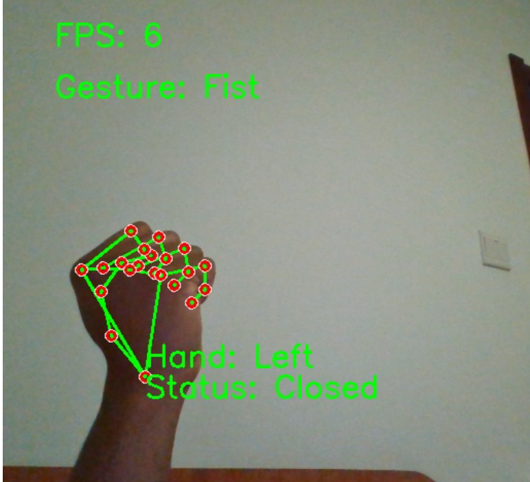
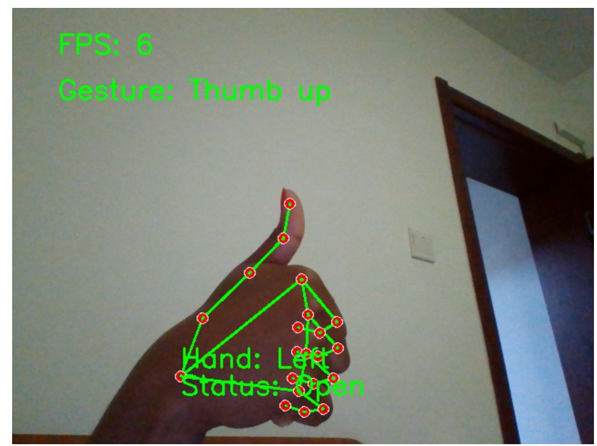

# Hand Gesture Recognition System**using MediaPipe and OpenCV in Django**

## Overview

This is simple web-based application that utilizes the MediaPipe library, OpenCV, and Django framework to perform real-time hand gesture recognition using computer vision techniques. The application captures video frames from a camera feed, detects hand landmarks using MediaPipe, and applies a predefined set of gesture recognition algorithms to determine the recognized gesture.

## Requirements

* Python 3.x
* OpenCV
* MediaPipe
* Django
* Camera

## Usage

* Clone this repository
* Open terminal where the folder project is located
* Run `python manage.py runserver`
* After the server starts follow the link or paste it in the web browser to start the program

## How it works

Once the program is launch, it provide a user interface to login/create an account. After creating account user can login and start the camera.

The system provides also an admin side. for admin login use:

> username: admin
>
> password: admin

The sample gestures implemented in the program are:

1. Fist
2. Ok sign
3. Thumb up
4. Index pointing

## Samples result

## Reference

[MediaPipe](https://pypi.org/project/mediapipe/)
